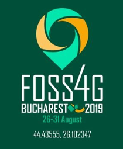
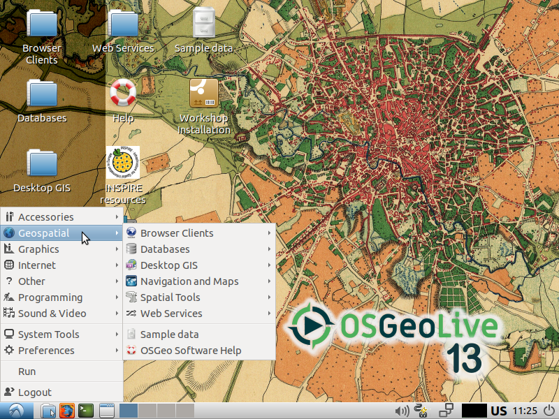
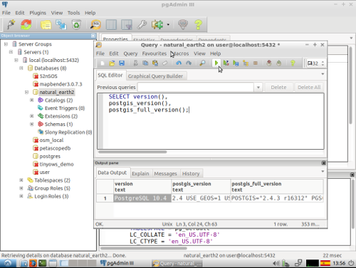
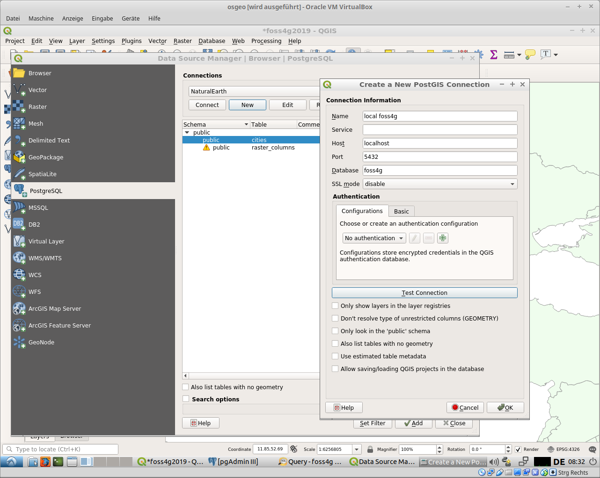
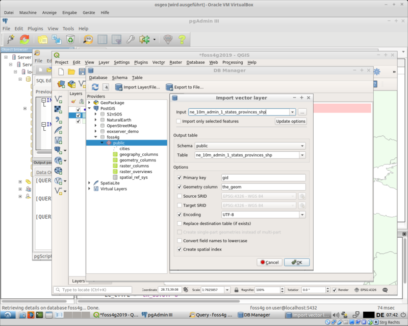

# Workshop PostgreSQL/PostGIS for beginners

[FOSS4G 2019 Workshop Bucharest (Romania)](https://2019.foss4g.org/)

 


## Astrid Emde

* WhereGroup GmbH Germany
* astrid.emde@wheregroup.com
*  [@astroidex](https://twitter.com/astroidex)


* FOSS Academy https://www.foss-academy.com/


## Lars Lingner

* with friendly support of GIS Consultant Lars Lingner Mappwebbing Germany
* lars@lingner.eu
*  [@mapwebbing](https://twitter.com/mapwebbing)


## What we learn 
* Why database?
* PostgreSQL / PostGIS
* SQL Basics
* Import data / Export data
* Spatial Functions
* Spatial Index
* Roles & handle access to your data


## OSGeoLive


This Workshop uses the brand new OSGeoLive (https://live.osgeo.org) Version 13.0 (August 2019). OSGeoLive is based on Lubuntu and contains a collection of more than 50 pre-installed software projects. OSGeoLive also contains example data which will be used for the workshop.



You can download OSGeoLive with the following link. You can install OSGeoLive, run it in a virtual machine (recommended) or use it on an USB stick.

* Download OSGeoLive Image http://live.osgeo.org/en/download.html
* Documentation https://live.osgeo.org/
* PostGIS Overview (OSGeoLive Overview) https://live.osgeo.org/en/overview/postgis_overview.html
* PostGIS Quickstart (OSGeoLive Quickstart) https://live.osgeo.org/en/quickstart/postgis_quickstart.html


## actual Software Versions

* PostgreSQL 11.x (2019-05-10) https://www.postgresql.org/
* PostGIS 2.5.x (2017-10-1) http://www.postgis.org/


### OSGeoLive 13.0

* PostgreSQL 10.9
* PostGIS 2.5.2

```sql
SELECT version(), postgis_version(), postgis_full_version();
```




## Data

* Natural Earth 
 * as ESRI Shapes - countries, provinces, rivers, populated places & more at /home/user/data
 * database: natural_earth2
* OpenStreetMap
 * database: osm_local


## additional information

* PostGIS in Action (August 2015, 2. Auflage) Regine Obe, Leo Hsu ISBN 9781617291395
* Paul Ramsey Blog Clever Elephant http://blog.cleverelephant.ca/
* Clever Elephant ;) https://www.youtube.com/watch?v=Gw_Q1JClH58
* Postgres OnLine Journal Regine Obe, Leo Hsu http://www.postgresonline.com/
* Modern SQL Blog Markus Winand https://modern-sql.com/slides https://use-the-index-luke.com/
* PostgreSQL books https://www.postgresql.org/docs/books/
* pgRouting: A Practical Guide (Mai 2017, 2. Auflage) Regine Obe, Leo Hsu ISBN: 9780989421737
* Find the right projection http://spatialreference.org/


## Why database?

* central storage of data - no data redundancy
* consistency of data
* multi-user access
* restricted access via access control and access management
* access your data via different tools
* combine different data and use SQL to explore and analyze
* backup, replication ...
  

## PostgreSQL

* supported by several other programs
* fast, powerful, reliable, robust
* easy to maintain
* follows SQL standard
* API to many programming languages
* subselects, functions, trigger, Foreign Data Wrapper, replication & more
* https://www.postgresql.org/about/


## PostGIS

* Extension for PostgreSQL
* let PostGIS do the work - not your Desktop GIS
* Follows standard - OGC Simple Feature Spezification for SQL and OGC ISO SQL/MM Spezification 
* Provides many spatial functions 
* Widley supported by other programs
* Easy import / export of spatial data (QGIS, shp2pgsql, pgsql2shp, ogr2ogr, dxf2postgis, osm2pgsql)
* Can use the advantages from PostgreSQL (user management, replication, indexing & more)
* Very powerful: vector & raster data, geometry (planar) and geography (spheroid), circular objects, 3D, 4D, point cloud, pg_routing for routing, topology
* Stores data as WKB (Well-known Binary) and displays it as WKT (Well-known text)
* http://www.postgis.org/
* http://postgis.net/docs/


## Database Clients

* pgAdmin III and new pgAdmin 4 https://www.pgadmin.org/
* psql command line client https://www.postgresql.org/docs/current/static/app-psql.html
* QGIS DB Manager integrated in QGIS
* DBeaver https://dbeaver.io/
* and many other


### Excercise 1: pgAdmin & first steps in the database

1. Open pgAdmin
2. Connect to database natural_earth2
3. Go to schema public and look for tables
4. Open a table and look for the geometry column. Can you read the geometry?
5. Open table spatial_ref_sys and filter by srid = 4326
7. Go to schema public -> views and open the metadata view geometry_columns


## How can you communicate with the database?

The communication with the database works via SQL - Structured Query Language.
 
* DDL - data definition language
* DML - data manipulation language
* DQL - data query language 


### DQL 

* DQL - to query your data (DQL is part of DML
) f.e to show all data from table spatial_ref_sys with srid = 4326

```sql
SELECT * FROM spatial_ref_sys WHERE srid=4326;
```

### DDL 

* DDL to create database, table, user, schema and more

```sql
CREATE DATABASE demo;
```

```sql
CREATE TABLE pois(
 gid serial PRIMARY KEY,
 name varchar,
 year int,
 info varchar
);
```

Modify your table

```sql
ALTER TABLE pois ADD COLUMN land varchar;
ALTER TABLE pois RENAME land TO country;
ALTER TABLE pois DROP COLUMN country;
ALTER TABLE pois ADD CONSTRAINT pk_gid PRIMARY KEY (gid); 
```

Delete your table

```sql
DROP TABLE pois;
```

### DML

* manipulate your data - create data, delete data, change data

```sql
INSERT INTO pois (name, year, info, geom) VALUES 
(
'Kölner Dom',
1248,
'https://en.wikipedia.org/wiki/Cologne_Cathedral'
);
```

```sql
DELETE FROM pois WHERE name = 'Kölner Dom';
DELETE FROM pois; -- deletes all data
DELETE FROM pois WHERE gid = 1111;
```

```sql
UPDATE pois SET name = 'Cologne Cathedral' WHERE name = 'Kölner Dom';
```

### Excercise 2: Create your own database with PostGIS extension 

1. Create your own database with the name **_foss4g_** 

Notice: Use lower case and no spaces as name for your database, tables columns! Makes live easier. As you do not have to use quotations - like "FOSS4G"

2. Change the connection and connect to your new database.

3. Load the extension **_postgis_** to your new database to be able to handle spatial data.

4. Check whether the postgis functions, **_spatial_ref_sys_** table and the metadata views are there


```sql
CREATE DATABASE foss4g;
```

Move to database *__foss4g_**

```sql
CREATE EXTENSION postgis;
```


### Excercise 3: Use the utility program createdb to create a database via command line 

* check the PostGIS Quickstart and see how the dabase demo was created 
* https://live.osgeo.org/en/quickstart/postgis_quickstart.html
* PostgreSQL provides utility programs like **_createdb_** and **_dropdb_** to communicate with the database

Choose :menuselection:`Systems Tools --> LX Terminal` from menu to open a Terminal window.

```sql
createdb -U user demo
createdb --help

psql -U user demo
CREATE EXTENSION postgis;
```

### Excercise 4: Create your own table cities

* create a new table **_cities_** with gid, name, country and geom (see poi example above)
* create a point for Bucharest (Romania) with ST_MakePoint - find the coordinate at https://www.latlong.net/place/dar-es-salaam-tanzania-1762.html

```sql
CREATE TABLE cities(
 gid serial PRIMARY KEY,
 name varchar,
 country varchar,
 geom geometry(point,4326)
);
```

```sql
INSERT INTO cities(
            name, geom, country)
    VALUES ('Bucharest',ST_SetSRID(ST_MakePoint(26.096306 , 44.439663),4326),'Romania');
```

```sql
INSERT INTO cities(
            name, geom, country)
    VALUES ('Dar es Salaam',ST_SetSrid(ST_MakePoint(39.273933, -6.812810),4326),'Tanzania');
```

```sql
INSERT INTO cities(
            name, geom, country)
    VALUES ('Cologne',ST_SetSRID(ST_MakePoint(6.958307 , 50.941357),4326),'Germany');
```

## QGIS to visualize your data

* You can visualize, edit and import/export data from a PostgreSQL/PostGIS database
* You need the information how to connect to the database - only authorized users can connect


  

### Excercise 5: QGIS: Load data from **_natural_earth2_** and from your new database

1. Open QGIS. Choose :menuselection:`Geospatial --> Desktop QGIS --> QGIS Desktop` .
1. Load countries from the database natural_earth2
1. Create a new PostGIS connection to your new database foss4g
1. Load your new table cities
1. Add a new point to your cities table and mark the place where you come from (approximately)


## QGIS import data to PostgreSQL via QGIS DB Manager

You can use the QGIS DB Manager to import/export data to/from your database. You find the QGIS DB Manager in the menu at Database -> DB Manager. You already need a connection to the PostgreSQL database that you would like to use.

Best way is to add the data you would like to import to a QGIS project. You can filter the data if you only want to import a subset of your data. 

To import data you have to follow the steps:

1. Open the DB Manager
1. Connect to your database
1. Use the Import layer/file button1. Choose your data for import
1. define a name for your table, the SRID, add a primary key (gid recommended)
1. Create a spatial index
1. Start the import
1. Add the imported data via drag & drop to your QGIS project



### Excercise 6: Load data from natural_earth2 shapes to your database

* Import ne_10m_admin_0_countries.shp to table ne_10m_admin_0_countries.shp
* /home/user/data/natural_earth2/ne_10m_admin_1_states_provinces_shp.shp to table ne_10m_admin_1_states_provinces_shp
* Also import provinces and only import the provinces from Romania to **_table provinces_romania_** (use Filter admin='Romania')
* Import all ne_10m_populated_places to table **_ne_10m_populated_places_**
* Have a look to your metadata view **_geometry_columns_**
 

## Get to know PostGIS functions 

* PostGIS Documentation http://postgis.net/docs/
* PostGIS Vector Functions see Chapter 8: http://postgis.net/docs/reference.html

### ST_AsEWKT or ST_AsText - to display the geometry as text

```sql
SELECT ST_AsText(geom) FROM cities; -- without SRID
SELECT ST_AsEWKT(geom) FROM cities; -- with SRID
SELECT ST_AsEWKT(geom) FROM provinces_romania;
``` 

### Geometry Constructors

* there are many functions to create geometries see Geometry Constructors
* http://postgis.net/docs/reference.html#Geometry_Constructors
* we used ST_MakePoint already - 2D, 3DZ or 4D is possible http://postgis.net/docs/ST_MakePoint.html

ST_GeomFromText - can be used for different geometry types
* http://postgis.net/docs/ST_GeomFromText.html
* http://postgis.net/docs/using_postgis_dbmanagement.html#OpenGISWKBWKT

```sql
Update cities set geom = ST_GeomFromText('POINT(6.958307 50.941357)',4326) where name = 'Cologne';
```

```sql
Update ne_10m_admin_0_countries set geom = ST_GeomFromText('MULTIPOLYGON(((0 0,4 0,4 4,0 4,0 0),(1 1,2 1,2 2,1 2,1 1)), ((-1 -1,-1 -2,-2 -2,-2 -1,-1 -1)))',4326) where name = 'Germany';
```

## Spatial Relationships and Measurements

* get information about your data f.e. distance, area, length, centroid


### Excercise 7: Calculate the area for each country

* http://postgis.net/docs/ST_Area.html
* Note that the area is calculated using the srid of the geometry. Use the calculation on the spheroid to get the r result in meters.

Calculate area without using the spheroid (units of the projection will be used)
```sql
SELECT gid, name, st_Area(geom)
  FROM public.ne_10m_admin_0_countries;
```

Calculate area using the Spheroid (result in squaremeters)
```sql
SELECT gid, name, st_Area(geom, true)
  FROM public.ne_10m_admin_0_countries;
```
Calculate area from Germany and Romania order by area
```sql
SELECT gid, name, st_Area(geom, true) as area
  FROM public.ne_10m_admin_0_countries
  WHERE name IN ('Germany','Romania') 
  ORDER BY area DESC;
```

### Excercise 8: Create a view with the centroid for each country

* Create a view with the centroid for each province
* try to load the view in QGIS
* have a look at your geometry_columns view

```sql
CREATE VIEW qry_country_centroid AS
SELECT gid, name, st_centroid(geom)
  FROM public.ne_10m_admin_0_countries;
```

Recreate the view and typecast your geometry column to point 

```sql
Drop view qry_country_centroid;
CREATE VIEW qry_country_centroid AS
SELECT gid, name, st_centroid(geom)::geometry(point,4326) as geom
  FROM public.ne_10m_admin_0_countries;
```

Use the function ST_PointOnSurface

```sql
CREATE VIEW qry_country_pointonsurface AS
SELECT gid, name, st_pointonsurface(geom)::geometry(point,4326) as geom
  FROM public.ne_10m_admin_0_countries;
```


### Excercise 9: 

* get back to your cities table from **_Excercise 4_**. Calculate the distance between Bucharest and your home town.
* use the spheroid for your calculations (use geography)
* https://postgis.net/docs/ST_Distance.html

```sql
SELECT g.name, you.name, ST_Distance(g.geom, you.geom,true) 
  FROM cities g, 
  cities you 
  WHERE 
    g.name = 'Dar es Salaam' 
    AND you.name='Cologne';
```

## Spatial Index and functional Index

* Your geometry column should have an index - can make your spatial queries faster
* the bounding box for every geometry will be stored in the index 
* you also can create a functional index - f.e. with ST_Transform

```sql
CREATE INDEX gist_cities_geom
  ON cities 
  USING GIST (ST_Transform(geom,25832));
```

## Geometry Processing

* There are many functions for geometry processing f.e. buffering, intersection, union, subdivide
* http://postgis.net/docs/reference.html#Geometry_Processing

### Exercise 10: Buffer populated places with 10 km

* Buffer the table ne_10m_populated_places with 10 km
* http://postgis.net/docs/ST_Buffer.html
* Note that you have to use geography to create a buffer in meter - use typecast ::geography

```sql
CREATE TABLE places_buffer_10_km as
SELECT 
  gid, 
  name, 
  ST_Buffer(geom::geography, 10000)::geometry(polygon,4326) as geom 
  FROM public.ne_10m_populated_places;
```

```sql
SELECT a.* 
  FROM places_buffer_10_km a, places_buffer_10_km b
  WHERE a.geom && b.geom 
  AND ST_Intersects(a.geom, b.geom) 
  AND a.gid != b.gid;
```

```sql
CREATE INDEX gist_places_buffer_10_km_geom
  ON places_buffer_10_km 
  USING GIST (geom);
```

Run the query again and check whether the index is used.

```sql
SELECT a.* 
  FROM places_buffer_10_km a, places_buffer_10_km b
  WHERE
  ST_Intersects(a.geom, b.geom) 
  AND a.gid != b.gid
```

```sql
EXPLAIN ANALYZE
SELECT a.* 
  FROM places_buffer_10_km a, places_buffer_10_km b
  WHERE
  ST_Intersects(a.geom, b.geom) 
  AND a.gid != b.gid
```


### Exercise 11: ST_Union - union all provinces from country Romania to one area 

* create a view called qry_tanzania_union
* use ST_UNION http://postgis.net/docs/ST_Union.html
* use table ne_10m_admin_1_states_provinces_shp and filter by admin Tanzania
* add column admin to your view (admin='United Republic of Tanzania') - you have to use GROUP BY 
* typecast the geomety column 
* have a look at your result with QGIS


```sql
SELECT ST_Union(geom)
  FROM public.ne_10m_admin_1_states_provinces_shp 
  WHERE admin='Romania';
```

```sql
SELECT 1 as gid, 
  admin, 
  st_AsText(ST_Union(geom))
  FROM public.ne_10m_admin_1_states_provinces_shp 
  WHERE admin='Romania'
  GROUP BY admin ;
```

```sql
CREATE VIEW qry_romania_union AS
SELECT 1 as gid, 
  admin, 
  ST_UNION(geom)::geometry(multipolygon,4326) as geom
  FROM public.ne_10m_admin_1_states_provinces_shp 
  WHERE admin='Romania'
  GROUP BY admin ;
```

### ST_Subdivide

* Divides a Multi-/Polygon in multiple smaller Polygons
* define max_vertices (default is 256, can't be < 8)
* Objekt should not have more than max_vertices
* http://postgis.net/docs/ST_Subdivide.html
* from PostGIS 2.3.0

```sql
CREATE TABLE provinces_subdivided AS 
  SELECT 
  name, 
  admin, 
  ST_Subdivide(geom) AS geom
  FROM ne_10m_admin_1_states_provinces_shp;

ALTER TABLE provinces_subdivided ADD COLUMN gid serial PRIMARY KEY;
```

* with definition of max_vertices (default is 256, not < 8)

```sql
DROP TABLE provinces_subdivided;
CREATE TABLE provinces_subdivided AS 
  SELECT 
  name, 
  admin, 
  st_subdivide(geom,20) AS geom
  FROM ne_10m_admin_1_states_provinces_shp ;

ALTER TABLE provinces_subdivided ADD COLUMN gid serial PRIMARY KEY;
```


```sql
CREATE INDEX provinces_subdivided_the_geom_gist
  ON provinces_subdivided
  USING gist
  (geom);

VACUUM ANALYZE provinces_subdivided;
```

### Example 12: ST_Subdivide

* Sometimes it makes sense to divide huge geometries in smaller parts to get faster calculations
* This example should show the use 
* Create a new function **_getCountrynameSubdivided()_** for table provinces_subdivided
* Have a look at EXPLAIN to check the performance

```sql
CREATE OR REPLACE FUNCTION getCountrynameSubdivided(mygeometry geometry) 
 RETURNS character varying 
 AS 'SELECT c.name FROM provinces_subdivided c 
 WHERE st_intersects(c.geom,$1);' 
LANGUAGE 'sql'; 
```

```sql
SELECT name, getCountrynameSubdivided(geom) 
 FROM public.ne_10m_populated_places 
 WHERE adm0name = 'Romania';
```

```sql
EXPLAIN ANALYZE
SELECT name, getCountrynameSubdivided(geom) 
 FROM public.ne_10m_populated_places 
 WHERE adm0name = 'Romania';
```

```sql
ALTER TABLE ne_10m_populated_places ADD COLUMN countryname varchar;

UPDATE ne_10m_populated_places 
SET countryname = getCountrynameSubdivided(geom);
```

Function, that uses the original province polygons

```sql
CREATE OR REPLACE FUNCTION getCountryname(mygeometry geometry) 
 RETURNS character varying 
 AS 'SELECT c.name FROM ne_10m_admin_1_states_provinces_shp c 
 WHERE st_intersects(c.geom,$1);' 
LANGUAGE 'sql'; 
```

```sql
EXPLAIN ANALYZE
SELECT name, getCountryname(geom) 
 FROM public.ne_10m_populated_places;
```

## PostgreSQL Roles and controlled access

PostgreSQL allows you to create roles (user with login and user without login) and also groups. 
These roles can have different power and get access via GRANT to different objects of your database - f.e a table. 

* See CREATE ROLE: https://www.postgresql.org/docs/current/static/sql-createrole.html
* See GRANT https://www.postgresql.org/docs/current/static/sql-grant.html


### Example 13: Create roles and grant access    

#. Create a role workshop_read and workshop_writer
#. Create a login role robert with a password and add to workshop_reader
#. Create a new login role wilma and add wilma to the workshop_writer role
#. Grant read access to table ne_10m_admin_1_states_provinces_shp to your new role workshop_reader
#. Grant write access to table cities to your new role workshop_writer 
#. Try to access and edit via QGIS 

```sql
CREATE ROLE workshop_reader;
CREATE ROLE workshop_writer;

CREATE ROLE robert WITH LOGIN PASSWORD 'foss4g';
GRANT workshop_reader TO robert;

CREATE ROLE wilma WITH LOGIN PASSWORD 'foss4g';
GRANT workshop_writer TO wilma;

GRANT SELECT ON ne_10m_admin_1_states_provinces_shp TO workshop_reader;
-- change to user robert
Select * from ne_10m_admin_1_states_provinces_shp;

GRANT ALL ON cities to workshop_writer;
GRANT USAGE ON SEQUENCE cities_gid_seq TO workshop_writer;

-- change to user wilma in pgAdmin
-- Run the following SQL
SELECT * from cities;
UPDATE cities SET name = 'TEST' WHERE name = 'Bucharest';
```


